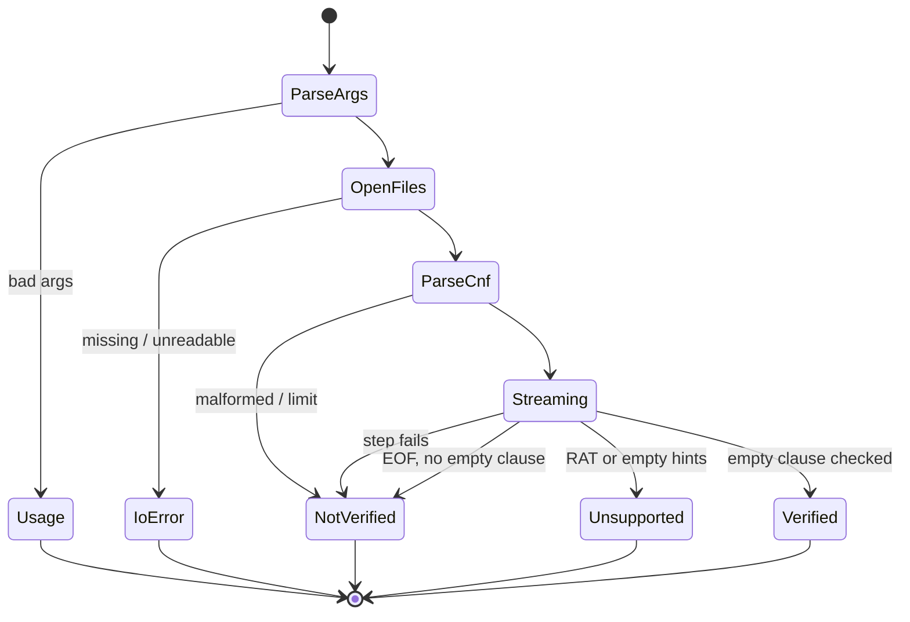
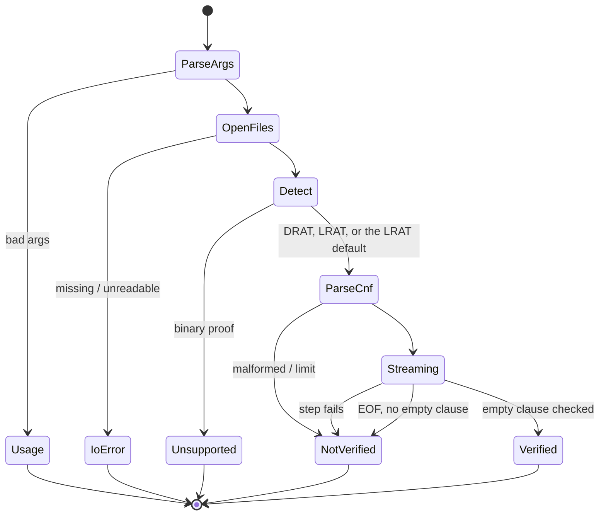

# App Flow — Refute

**Date:** 2026-08-13 · **PRD:** [PRD.md](PRD.md) · **TDD:** [TDD.md](TDD.md)

Two surfaces. The CLI exists in milestone 1; the playground is milestone 4 and is
designed here so that milestone 1's library API does not have to be rewritten to
support it (no `std::process::exit` in the library, no `eprintln!` in the checker,
no filesystem assumptions below `main`).

---

## Part 1 — CLI (milestone 1)

### Entry points

- `refute <formula.cnf> <proof.lrat>` — the only real one.
- `refute --help`, `refute --version`.
- Called from a shell script or CI step that reads the exit code. This is the
  primary consumer and the reason the output strings are a contract.

### The happy path

1. Two paths given. Both open.
2. CNF parses. Nothing printed unless a warning applies.
3. Proof streams. Each step checked. Nothing printed.
4. A step adds the empty clause and checks. Print `s VERIFIED`. Exit 0.

Silence until the verdict is deliberate: this is a tool that gets piped, and a
progress bar in a pipe is noise. `--stats` opts into detail on stderr.

### Every state

| State | Stdout | Stderr | Exit | Notes |
|---|---|---|---|---|
| Verified | `s VERIFIED` | — | 0 | The only success. Matches `drat-trim`'s wording so existing scripts and the author's gate keep working |
| Not verified | `s NOT VERIFIED` | `refute: step 331, line 197: hint 12 is already satisfied` | 1 | Reason, step id and line number always |
| Unsupported | `s UNSUPPORTED` | `refute: line 205: RAT hint block; milestone 1 checks RUP hints only` | 2 | **Never confusable with success.** A caller grepping for `VERIFIED` alone would match `NOT VERIFIED`, so the documented test is on the exit code |
| Parse error | `s NOT VERIFIED` | `refute: proof line 4109: expected 0 terminator, found end of file` | 1 | A file we cannot read is a proof we cannot accept — fail closed |
| File missing / unreadable | — | `refute: cannot open 'proof.lrat': No such file or directory` | 3 | Distinct from 1: nothing was checked. Conflating "no proof" with "bad proof" hides typos in CI |
| Wrong arguments | — | usage, one line | 3 | |
| Empty proof file | `s NOT VERIFIED` | `refute: proof contains no empty clause` | 1 | |
| Limit exceeded | `s NOT VERIFIED` | `refute: formula line 12: variable 100000000 exceeds limit 67108864` | 1 | Names the limit and its value so it is actionable |
| Slow (large proof) | nothing until the end | with `--stats`, a line every 10^6 steps | — | No spinner. `--stats` is the answer to "is it alive" |
| Interrupted (Ctrl-C) | — | — | 130 | No partial verdict is ever printed. A half-checked proof is not a verdict |

### Transitions

### Dead ends

None. Every terminal state prints an actionable line and a distinct exit code.
The one to watch is `Unsupported`: a user could reasonably read it as "your proof
is fine, my checker is not" and stop. The message therefore names the next step —
"use `drat-trim` for RAT proofs until milestone 1b" — rather than only stating the
limitation.

### Accessibility (CLI)

Verdicts are plain ASCII with no colour and no Unicode; colour is never the only
signal because there is no colour. Output is stable enough to `grep`, which is
what a screen-reader user's script will do. No box drawing, no progress
animation, nothing that renders as a wall of escape codes in a log file.

---

## Part 1b — what milestone 1b changes in the CLI (2026-08-13)

No new screen, no new flag, no new exit code. Three of the rows above change
their content.

| Row | Was | Becomes |
|---|---|---|
| Unsupported | `refute: line 205: RAT hint block; milestone 1 checks RUP hints only` | `refute: proof line 1: this is a binary proof; refute reads text LRAT. Re-run kissat with --no-binary and drat-trim with -L` — the only remaining unsupported construct |
| Not verified | `refute: step 331, line 197: hint 12 is already satisfied` | unchanged for RUP steps; a RAT step adds the block: `refute: step 48, proof line 4, resolvent block 47: no resolvent block for a clause holding the negated pivot -21` |
| Not verified | a bare empty clause with no hints exited 2 | exits 1: `refute: step 9999, proof line 1: a lemma with no literals has no pivot` |

The transition `Streaming --> Unsupported: RAT or empty hints` becomes
`OpenFiles --> Unsupported: binary proof`, because the only unsupported
construct is now recognised on the first line rather than mid-stream. Every
other transition is unchanged.

The dead-end note still applies and gets better: `UNSUPPORTED` now always names
the command that fixes it, rather than naming a milestone the reader has to wait
for.

---

## Part 1c — what milestone 2 changes in the CLI (2026-08-14)

One new decision happens before anything is checked — which format the proof is
— and it is deliberately invisible when it goes right.

### Entry points

- `refute <formula.cnf> <proof>` — unchanged, and now accepts either format.
  The proof is classified by reading it, never by its extension.
- `refute check <formula.cnf> <proof>` — the same thing. Accepted only when
  there are exactly three positional arguments and the first is `check`.
- `refute --drat ...` / `refute --lrat ...` — skip detection entirely.
- `refute --help`, `refute --version` — unchanged, whole-command-line only.

### The happy path, and the one new step in it

1. Two paths given. Both open.
2. **The first kilobyte of the proof is peeked. Binary means stop; otherwise
   exactly one of the two grammars accepts the first step, and that is the
   reader.** Nothing is printed.
3. CNF parses. Nothing printed unless a warning applies.
4. Proof streams. Each step checked. Nothing printed.
5. A step derives the empty clause and it checks. Print `s VERIFIED`. Exit 0.

### States that change or arrive

| State | Stdout | Stderr | Exit | Notes |
|---|---|---|---|---|
| Verified, DRAT | `s VERIFIED` | — | 0 | Identical to the LRAT row. A reader who cannot tell which checker ran, from the verdict line, is reading the contract correctly |
| Not verified, RAT step | `s NOT VERIFIED` | `refute: step 331, proof line 197, resolvent block 46: the resolvent with clause 46 on pivot 21 is not implied by unit propagation` | 1 | The candidate is named in the checker's own numbering — originals `1..n` in file order, lemmas from `n+1` — which is the LRAT numbering a reader already knows |
| Neither grammar accepts the proof | `s NOT VERIFIED` | the LRAT reader's own parse error, unchanged from milestone 1 | 1 | Deliberate: a file nobody can read gets the incumbent's message rather than a new one saying only "unrecognised" |
| Wrong format forced | `s NOT VERIFIED` | a parse error from the reader that was asked for | 1 | `--drat` on an LRAT file is a rejection, not a usage error: the user made a claim about the file and the file contradicted it |
| Unsupported | `s UNSUPPORTED` | `refute: proof line 1: this is a binary proof; refute reads text DRAT and text LRAT. Re-run kissat with --no-binary` | 2 | The message loses its "then drat-trim with -L", because that step is no longer required |
| `--stats`, DRAT run | — | a third line: propagations, watch visits, RAT additions, candidates checked, occurrence updates | — | Printed only when the DRAT checker ran, so the counter block is never a wall of zeroes |

### Transitions

`Detect` is the only new state, it has no output of its own, and it cannot reach
`Verified` — every route to a verdict still goes through a checker.

### Dead ends

Still none, and one is now shallower. A user who hands over the wrong file used
to get a parse error about a token; they now get a verdict from the reader that
matches what the file actually is, so the common mistake — checking the `.drat`
against the LRAT reader — stops being a mistake at all.

The `UNSUPPORTED` message keeps naming the command that fixes it. It is now a
shorter command, which is the point of the milestone.

---

## Part 2 — Playground (milestone 4, designed not built)

A static GitHub Pages page. WASM module, no server, no upload, no analytics, no
storage. Everything runs in the tab.

### Entry points

- The Pages URL, from the README or a citation in the author's certificate notes.
- A deep link naming a preloaded example: `?example=vdw-a4`.

### The happy path

1. Land. One sentence explaining what the page checks, then two drop targets
   (formula, proof) and a row of preloaded examples.
2. Click a preloaded example, or drop two files.
3. A verdict panel: the verdict word, the step count, the time taken.
4. If not verified: the failing step id, the line, the reason, and the offending
   line's text.

### Every state of every screen

| Screen | Loading | Empty | Populated | Error | Unauthorised | Offline / slow |
|---|---|---|---|---|---|---|
| Landing | WASM fetch: skeleton, controls disabled with a visible "loading checker" label | The default: explanation, drop zones, examples. Never a blank panel | Files named, sizes shown, Check enabled | WASM failed to load: "the checker could not start — the CLI is at <repo link>" | n/a — no accounts | Page is static and cacheable; works fully offline after first load |
| Checking | Progress by steps checked, with a cancel control | n/a | n/a | Panic in WASM is caught at the boundary and reported as an internal error, never as a verdict | n/a | Runs on a Web Worker so the tab never freezes |
| Verdict | n/a | n/a | Verdict word, counts, timing | Parse or limit failure shown as `NOT VERIFIED` with the reason and line | n/a | n/a |
| Memory exceeded | n/a | n/a | n/a | "This proof needs more memory than a browser tab allows (peak N clauses). Use the CLI." with the exact command | n/a | The one failure that must not look transient — no retry button |

The last row is the important one. A 200 MB LRAT proof will not check in a tab,
and a page that offers "try again" after an OOM is lying to the user.

### Permissions per state

There are none, and that is the design: no login, no session, no revocation
semantics, nothing leaves the machine. The privacy claim "your files are never
uploaded" must be literally true — no telemetry, no error reporting service, no
font or script from a third-party origin, so that the network tab confirms it.

### Dead ends

- WASM unsupported or blocked: the panel links to the CLI and to a prebuilt
  release binary. Never a spinner that never resolves.
- A proof that is `UNSUPPORTED`: shows what the construct was and where, and links
  to the milestone that will handle it.

### Accessibility

Keyboard path: skip link → example buttons → formula file input → proof file
input → Check → verdict panel, which receives focus and is an
`aria-live="polite"` region so the verdict is announced. Drop zones are also real
`<input type=file>` elements, because drag and drop alone is not operable by
keyboard. Verdict is never conveyed by colour alone: the word `VERIFIED` /
`NOT VERIFIED` / `UNSUPPORTED` is always present in text, with a shape (check /
cross / dash) beside it.
